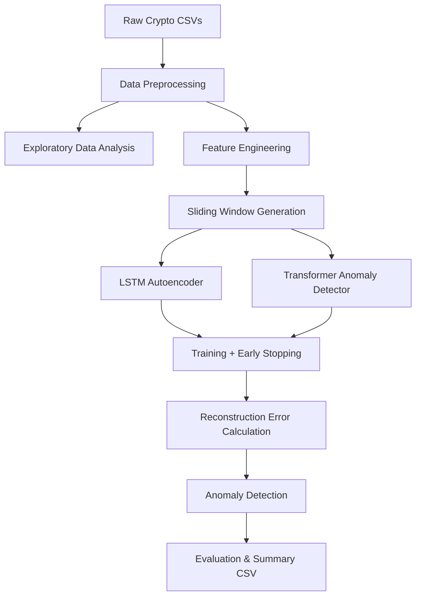

# 🚀 Cryptocurrency Anomaly Detection using Deep Learning

This project implements **anomaly detection in financial time-series data** (cryptocurrency OHLCV data) using deep learning models:
- **LSTM Autoencoder**  
- **Transformer-based Anomaly Detector**

It supports **data preprocessing, exploratory data analysis (EDA), model training with hyperparameter tuning, anomaly detection, and results visualization**.

## 📂 Project Structure

```plaintext
cryptocurrency/
├── data_preprocessing.py   # Preprocess raw crypto CSVs (scaling, returns, train/test split)
├── analysis.py             # Exploratory data analysis (EDA) plots
├── train.py                # Model training with early stopping, Huber loss, dropout, noise
├── detect.py               # Anomaly detection logic (reconstruction error thresholding)
├── tune.py                 # Hyperparameter tuning with Optuna
├── models/
│   ├── lstm_autoencoder.py
│   └── transformer_anomaly.py
├── utils.py                # Helper functions (sliding windows, plotting, device)
├── main.py                 # Main pipeline (EDA → training → anomaly detection → results)
├── results/                # Saved plots and summary CSV
└── summary.csv             # Final results table
```

## 📊 Dataset

- **Source**: Custom multi-coin **cryptocurrency dataset** (23 coins)
- **Format**: CSV files with OHLCV data (`Open`, `High`, `Low`, `Close`, `Volume`)
- **Features engineered**:
  - Daily returns
  - Log returns
  - Sliding windows of historical prices
  - Scaled features (StandardScaler / MinMaxScaler)

## 🔎 Exploratory Data Analysis (EDA)

Performed with `analysis.py`:
- 📈 Volume trends across coins
- 📉 Daily returns vs time
- 📊 Cumulative returns
- 📉 Drawdown curves
- 🔥 Return correlation heatmaps
- 🔥 Volume correlation heatmaps

## 🧠 Models Implemented

### 1️⃣ LSTM Autoencoder
- Encoder–decoder with reconstruction loss
- Dropout + L2 regularization to prevent overfitting
- Early stopping with patience

### 2️⃣ Transformer-based Anomaly Detector
- Multi-head self-attention for sequence learning
- Tunable `d_model`, `n_heads`, `num_layers`
- Stronger generalization on long sequences

## ⚙️ Training & Hyperparameter Tuning

- **Framework**: PyTorch
- **Optimizer**: Adam with weight decay
- **Loss**: Huber Loss for robustness
- **Early stopping** with patience
- **Optuna** for hyperparameter search:
  - Window size (`60, 90, 120`)
  - Hidden size / d_model
  - Dropout rate
  - Learning rate

## 🔄 Workflow Diagram



## 🏆 Results

### 🔹 Best Model per Coin (23 coins)

| Coin | Model | Best Val Loss | Threshold | Anomalies |
|------|-------|---------------|-----------|-----------|
| Aave | Transformer | 0.000330 | 0.000290 | 55 |
| BinanceCoin | Transformer | 1.550140 | 0.000279 | 186 |
| Bitcoin | Transformer | 0.122574 | 0.000713 | 445 |
| Cardano | Transformer | 0.144080 | 0.000809 | 223 |
| ChainLink | Transformer | 0.084783 | 0.000272 | 277 |
| Cosmos | Transformer | 0.225756 | 0.000141 | 169 |
| CryptocomCoin | Transformer | 0.015070 | 0.000216 | 180 |
| Dogecoin | Transformer | 1.540010 | 0.000152 | 434 |
| EOS | Transformer | 0.000208 | 0.000172 | 62 |
| Ethereum | Transformer | 0.027051 | 0.000343 | 185 |
| Iota | Transformer | 0.000022 | 0.000303 | 0 |
| Litecoin | Transformer | 0.001537 | 0.000401 | 201 |
| Monero | Transformer | 0.067336 | 0.000409 | 300 |
| NEM | Transformer | 0.010210 | 0.000137 | 251 |
| Polkadot | Transformer | 0.000444 | 0.000466 | 64 |
| Solana | Transformer | 0.056384 | 0.001565 | 91 |
| Stellar | Transformer | 0.002979 | 0.000195 | 225 |
| Tether | Transformer | 0.000647 | 0.000605 | 196 |
| Tron | Transformer | 0.000160 | 0.000284 | 93 |
| USDCoin | Transformer | 0.000142 | 0.000121 | 82 |
| Uniswap | Transformer | 0.000419 | 0.000293 | 59 |
| WrappedBitcoin | Transformer | 0.042120 | 0.000493 | 178 |
| XRP | Transformer | 0.001853 | 0.000089 | 235 |

### 📌 Key Findings

The **Transformer consistently outperformed LSTM Autoencoder** across all 23 coins.

## 📈 Example Outputs

- ✅ Training vs Validation Loss curves
- ✅ Reconstruction Error Distributions
- ✅ Anomaly Detection Plots
- ✅ Risk metrics (Volatility, Sharpe Ratio)

## 🚀 Getting Started

### Prerequisites

```bash
pip install torch pandas numpy matplotlib seaborn scikit-learn optuna
```

### Usage

1. **Run the complete pipeline**:
   ```bash
   python main.py
   ```

2. **Individual components**:
   ```bash
   # Data preprocessing
   python data_preprocessing.py
   
   # Exploratory analysis
   python analysis.py
   
   # Model training
   python train.py
   
   # Anomaly detection
   python detect.py
   
   # Hyperparameter tuning
   python tune.py
   ```

## 🔮 Future Improvements

- Add **ground-truth anomaly labels** for quantitative evaluation (Precision/Recall/F1)
- Extend to **multi-asset correlation-based anomalies**
- Deploy as a **real-time monitoring dashboard**


## 🤝 Contributing

1. Fork the repository
2. Create your feature branch (`git checkout -b feature/AmazingFeature`)
3. Commit your changes (`git commit -m 'Add some AmazingFeature'`)
4. Push to the branch (`git push origin feature/AmazingFeature`)
5. Open a Pull Request

## 👩‍💻 Author

**Shivani Tiwari** ([@shivaprogrammer](https://github.com/shivaprogrammer))

